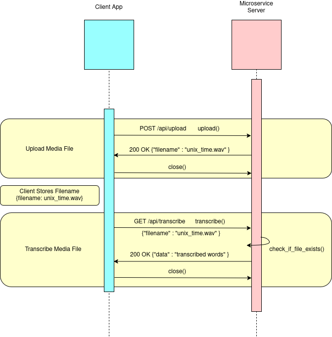

# Run Speech To Text Tool (STT Tool)

This is a microservice to execute the Speech to Text Tool. Once this communication contract is published, it must not change so other services can rely on it.

This microservice uses the Multipart Form Data Parser written by Brian Khuu in C: 
https://github.com/mofosyne/minimal-multipart-form-data-parser-c

________________________________________________

## How to REQUEST Data

Since this program is not requesting data, rather, it is posting data using

HTTP Method: POST

URL: http://localhost:8001/api/upload

Required Header: Accept:application/json
Example Request (cURL):

curl -X POST -H 'Content-Type: video/mp4' -F "bob=@/home/ango/Downloads/Dream.mp4" http://localhost:1234/api/upload

___________________________________________________

## How to RECEIVE DATA

Expected Successful JSON Response (HTTP 200):

{"transcribe": "transcription summarized notes"}

____________________________________________________

## Required RESPONSE Format

|      Field     |   Type   |             Description               |
| -------------- | -------- | ------------------------------------- |
| transcription  |  String  | Transcribed data from the media file  |

_____________________________________________________

## UML Sequence Diagram



_____________________________________________________
## Limitations
- 100MB files (100,000,000 Bytes)

_____________________________________________________
# How to Run the Speech-to-Text-Tool

## 1. Demultiplex a Media Input File to an Audio File for Whisper

We first have to demultiplex the media input file to a slower rate. 

1. Compile the demux_decode program to separate the video and the audio file.
```
gcc demux_decode.c -I /usr/include/ffmpeg -lavcodec -lavutil -lavformat -o demux_decode
./demux_decode your_input.wav z-audio
```
2. Play the z-audio file to ensure it works
```
ffplay -f f32le -ar 44100 z-audio
```
3. Convert the audio file to a .wav file.
Have the wav file follow the command in order to be used with Whisper
```
ffmpeg -f f32le 16000 -ac 2 -i z-audio z-audio-output.wav
```
Then go to the directory where Whisper is at to run! 

## 2. Input a .wav file to be Transcribed by Whisper

Follow these Whisper instructions: https://github.com/ggml-org/whisper.cpp?tab=readme-ov-file

- Install Whisper from GitHub with the ggml-format. Now git clone the repo, cmake, etc.
  https://github.com/ggml-org/whisper.cpp#ggml-format

    - git clone the Whisper.cpp repository
    - install the medium.en model instead of the base.en 
    - install cmake. Since I am using Fedora, use sudo dnf install cmake
  
```
./build/bin/whisper-cli -f $HOME/Downloads/MLKDream.wav

// Another example to output a transcription file using .txt:
/home/Riley_Lee/Code/whisper.cpp/build/bin/whisper-cli /home/whisper/cpp/models/ggml-base.en.bin -f path_of_wav_file > time_stamp.txt

```

## 3. Minimal Multipart Form Data Parser-c
- https://github.com/mofosyne/minimal-multipart-form-data-parser-c
- git clone the library and compile the library locally


_____________________________________________________
# Transcribe

Method: /api/transcribe
Purpose: Client sends a JSON string to the server to retrieve the transcribed data.
The server sends the transcribed data back to the client.

How client requests a file to be transcribed:
The client sends the following to the server of the requested filename:
```curl -X POST -H 'Content-Type: video/mp4' -F "bob=@/home/ango/Downloads/Dream.mp4" http://localhost:1234/api/transcribe 
    <your_path_to_the_filename>
```

Input: JSON string
{
"filename" : "1234.mp4"
}

Output: Transcribed data sent from the server back to the client
{
"data" : "Hi there!"
}

Workflow:
1. Client sends request to server {"filename": "1234.mp4"} to the server
2. Server uses the JSON library to convert the JSON string into a JSON object
3. Retrieve the filename from the JSON object
4. Use the filename to transcribe
5. Make the transcription file
6. Send the transcription data back to the client {"data":"Hi there!"}


