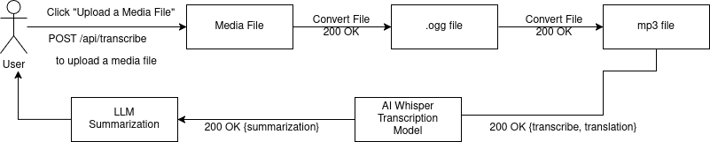

# Run Speech To Text Tool

This is a microservice to execute the Speech to Text Tool. Once this communication contract is published, it must not change so other services can rely on it 
________________________________________________

## How to REQUEST Data

Since this program is not requesting data, rather, it is posting data using

HTTP Method: POST

URL: http://localhost:8001/api/transcribe

Required Header: Accept:application/json

Example Request (cURL):

curl -X POST "http://localhost:8001/api/transcribe" -H "Accept: application/json"

___________________________________________________

## How to RECEIVE DATA

Expected Successful JSON Response (HTTP 200):

{"transcribe": "transcription summarized notes"}

____________________________________________________

## Required Response Format

 Field 	Type 	Description
transcription 	string Transcribed data from the media file
_____________________________________________________

## UML Sequence Diagram
[Speech-To-Text.drawio](../../Downloads/Speech-To-Text.drawio)
